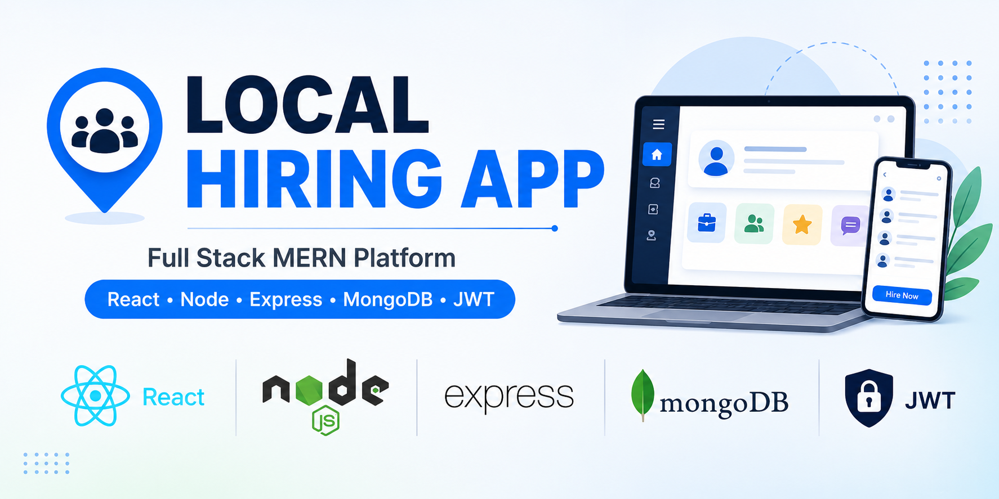
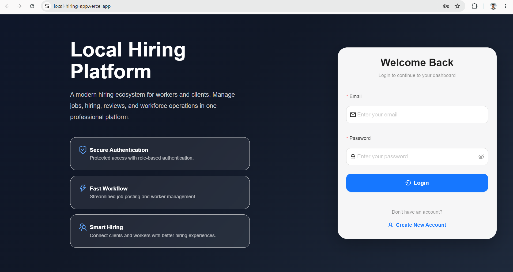
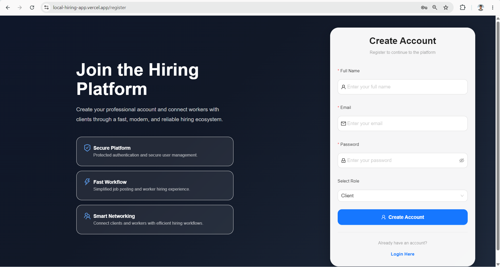
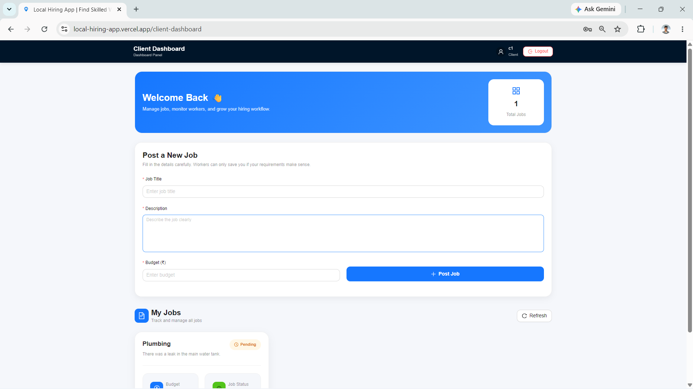
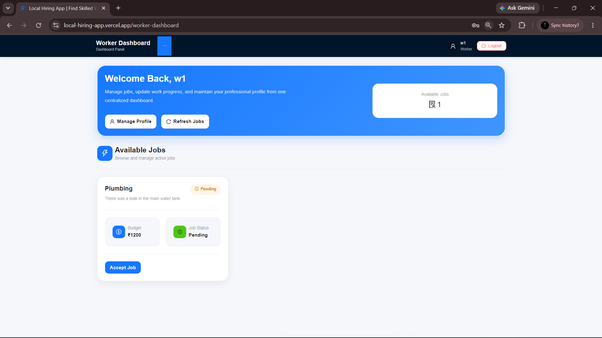
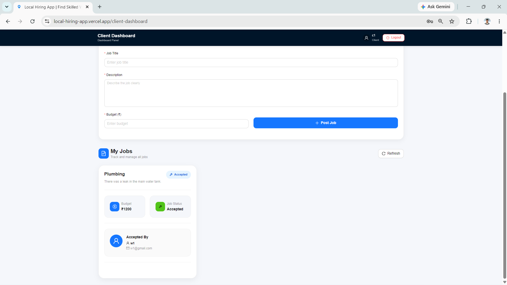
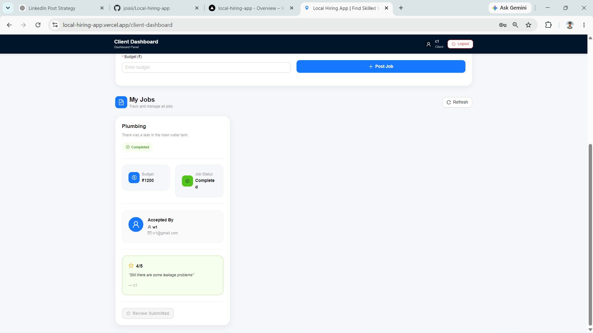
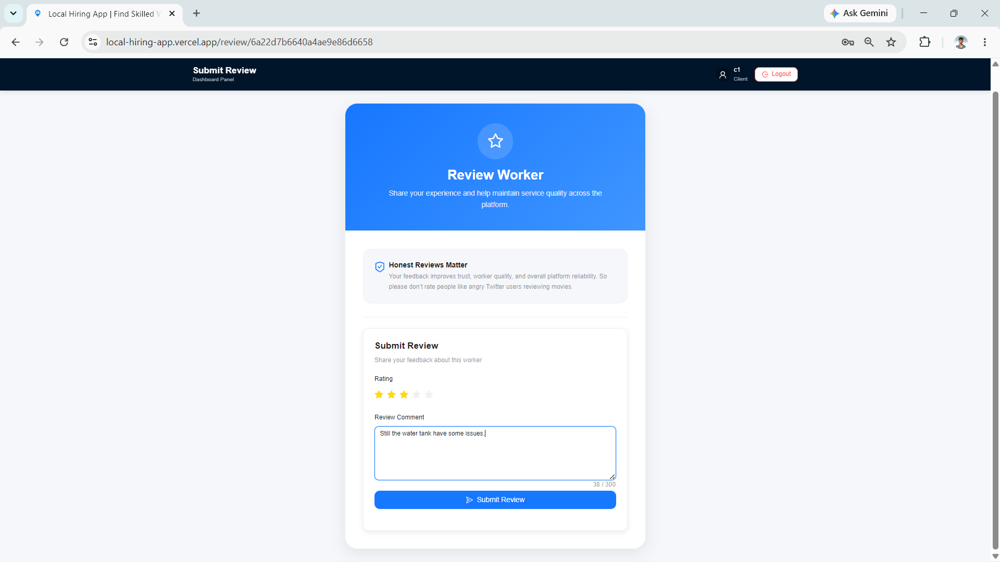
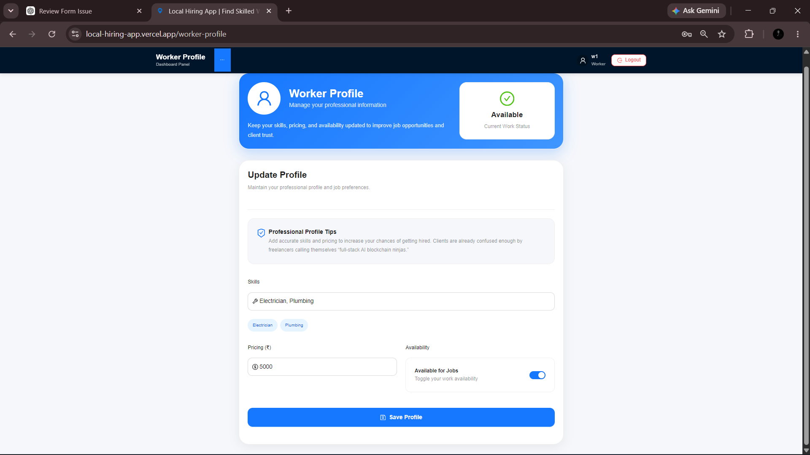

# Local Hiring App

A full-stack MERN application that connects clients with skilled local workers through a streamlined hiring process.

---

## Quick Links

🚀 Live Demo: https://local-hiring-app.vercel.app/

💻 GitHub Repository: https://github.com/joisii/Local-hiring-app

---

## Project Overview

Local Hiring App is designed to bridge the gap between clients and local workers by providing a platform where jobs can be posted, accepted, managed, and reviewed from a single application.

The system supports role-based access for both clients and workers, ensuring a structured workflow from job creation to completion.

---

## Features

### Authentication & Security

* User Registration
* User Login
* JWT Authentication
* Protected Routes
* Role-Based Access Control

### Client Features

* Create New Jobs
* Manage Posted Jobs
* View Worker Profiles
* Track Job Progress
* Submit Reviews & Ratings

### Worker Features

* Browse Available Jobs
* Accept Jobs
* Update Job Status
* Manage Personal Profile

### Workflow Management

* Pending Jobs
* Accepted Jobs
* Ongoing Jobs
* Completed Jobs

### Reviews & Ratings

* Review Submission
* Worker Rating System

---

## Application Screens

### Login Page

### Register Page

### Client Dashboard

### Worker Dashboard

### Create Job

### Manage Jobs

### Reviews

### Profile

---

## Tech Stack

### Frontend

* React.js
* Vite
* Ant Design
* React Router

### Backend

* Node.js
* Express.js

### Database

* MongoDB

### Authentication

* JSON Web Token (JWT)

### Version Control

* Git
* GitHub

### Deployment

* Vercel
* Render

---

## Job Workflow

Client Creates Job

⬇️

Worker Accepts Job

⬇️

Work In Progress

⬇️

Job Completed

⬇️

Review & Rating

---

## Project Structure

frontend/

backend/

assets/

screenshots/

README.md

---

## Installation

Clone Repository

git clone https://github.com/joisii/Local-hiring-app.git

Install Dependencies

npm install

Run Application

npm run dev

---

## Learning Outcomes

This project helped strengthen my understanding of:

* Full-Stack MERN Development
* REST API Design
* Authentication & Authorization
* Database Modeling
* State Management
* Deployment Workflows
* Git & GitHub Collaboration

---

## Author

Joel B Mathew

Full Stack MERN Developer
